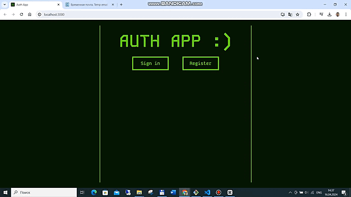
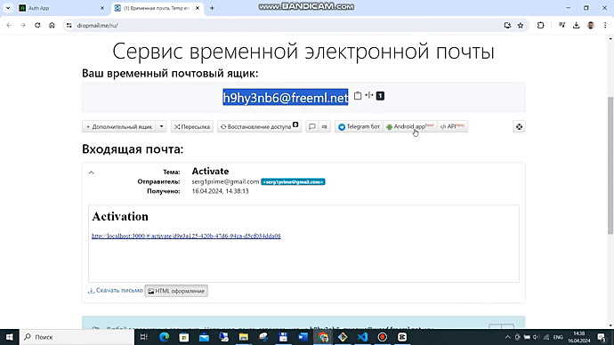
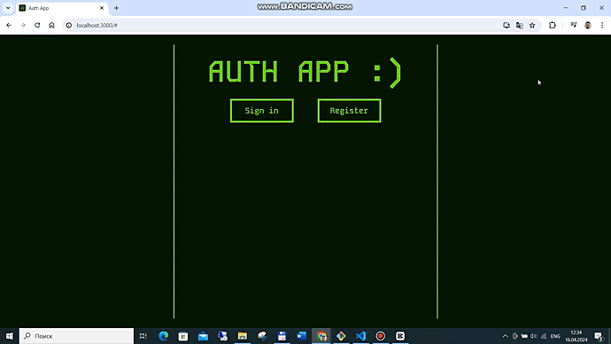
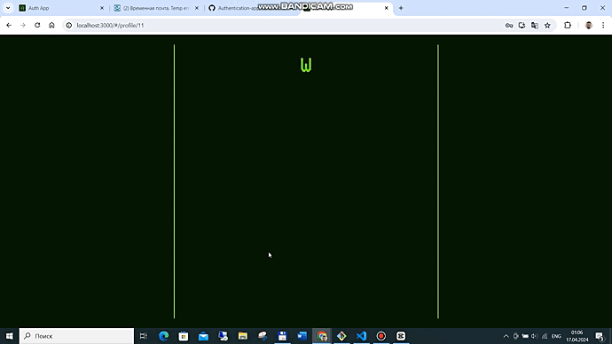
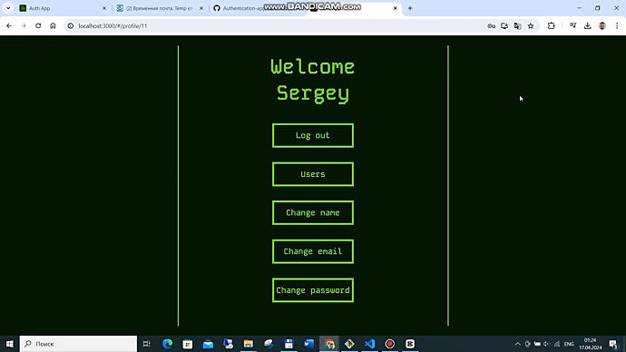
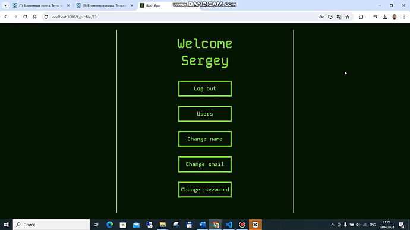

# Authentication App
A single-page application that alows user to register, login or change the password. Loged user can see the list of all activated users, change his name password or email. Implements the look and behaviour of old computers.

# Table of contents
- [Technologies used](#technologies-used)
- [Structure](#structure)
- [Features & Functionality](#features--functionality)
- [Reflections](#reflections)

# Technologies used
- React.js
- Redux
- React Router(v6)
- JSX
- TypeScript
- JavaScript
- Axios, API
- Node.js
- Espress
- SQL
- ORM
- Nodemailer
- JWT
- Sass (SCSS)
- BEM methodology

# Structure
Frontend is built using functional components and React Hooks. Each component is abstract and fully reusable. Components are styled using Sass (SCSS). BEM methodology is used for naming and styling.
Backend is built using Express. Registered users are stored in SQL database.

# Features & Functionality

## App 
- App replicates the behaviour and appearance of old computers.
- Navigation is implemented using React Router.
- `Wait` function was used in all requests to server in order to simulate the loading proccess and demonstrate the loader.
- If user is loged for too long and refresh token is expired, after page reload or any request to server user will be immediately loged out.

## Registration page
- Checks entered data for validity.
- In case of network server or validation error shows appropriate message.
- Sending an activation email.

## Activation page
- Checks if this user needs activation.
- If user is already activated or doesn't exist shows appropriate message.
- Activates and logging this user in.

## Login page
- Asks to enter email and password.
- Checks if such user exists and activated.
- Logging user in and sending access and refresh tokens. Access token is stored in locale storage while refresh token is stored in cookies.
- In case of error shows appropriate message.
- Alows to remember email and password.

## Verify and reset pages for non authenticated user
- Asks to enter an email, end verifies it.
- Sends one time password and saves it to the cookies.
- After entering password from email compares it with password from cookies.
- After confirmition redirects user to reset page and asks to enter new password and repeat it.
- If passwords don't match or new password is the same as old password shows appropriate message.
- After reset alows to return to login page.
- In case of error in any step shows appropriate message.
- Alows to reset password for many users in different sessions without any conflict.

## Profile main page
- Shows loged user name.
- Alows to log out and navigate between profile pages.

## Users list profile page
- Shows all activated users.
- Pagination is implemented.
- In case of error or no users shows appropriate message.

## Rename profile page
- Asks to enter new name and changes it in database.
- In case of error shows appropriate message.
- Smoothly changes name in profile already after successfully change.

## Change email profile page
- Asks to enter users password and verifies it.
- Asks to enter new email and checks if it isn't used.
- Sends one time password to new email and saves it to users cookies.
- After entering password from email compares it with password from cookies.
- After confirmition changes users email and notifies old email about changes.
- In case of error in any step shows appropriate message.

## Change password profile page
- Asks to enter users password and verifies it.
- Asks to enter new password and repeat it, checks if it isn't the same as user using.
- Changes users password.
- In case of error in any step shows appropriate message.

## Reflections
Project goals included using technologies learned up until this point, familiarizing myself with documentation for new features and creating an application that replicates the design and functionality of programs from the 60s.

I ran into necessity to use new features, such as:
 - loaders
 - error boundaries
 - data fetching
 - creating custom middlewares
 - mailing
 - Another challenge was to implement troubleproof refresh funtionality.

 At the end of the day, I've figured out how to combine frontend and backend together in bigger project and what problems can be encountered in the process.
