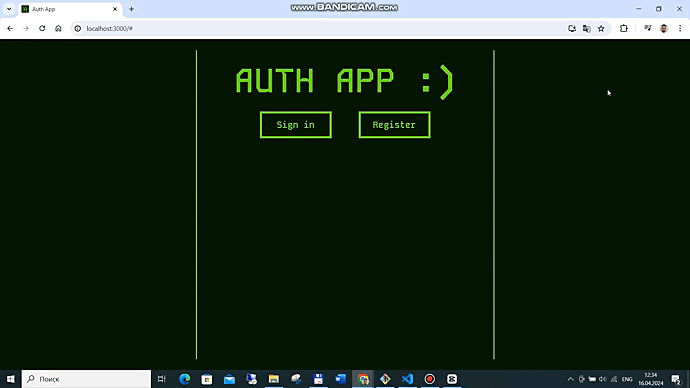
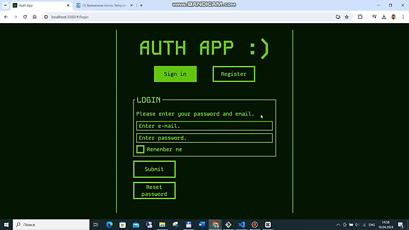

# Authentication App
A single-page application that alows user to register, login or change the password. Loged user can see the list of all activated users, change his name password or email. Implements the look and behaviour of old computers.

# [DEMO](https://sergey-mironenko.github.io/authentication-app/)

# Table of contents
- [Technologies used](#technologies-used)
- [Structure](#structure)
- [Features & Functionality](#features--functionality)
- [Reflections](#reflections)

# Technologies used
- React.js
- React Router(v6)
- JSX
- TypeScript
- JavaScript
- Axios, API
- Node.js
- Espress
- SQL
- Sequelize
- Nodemailer
- JWT
- Sass (SCSS)
- CSS Modules
- BEM methodology

# Structure
Frontend is built using functional components and React Hooks. Each component is abstract and fully reusable. Components are styled using Sass (SCSS). BEM methodology is used for naming and styling.
Backend is built using Express. Registered users are stored in SQL database.
`Wait` function was used in all requests to server in order to simulate the loading proccess and demonstrate the loader.

# Features & Functionality

## App 
- App replicates the behaviour and appearance of old computers.
- Navigation is implemented using React Router.

## Registration page
- Checks entered data for validity.
- In case of network server or validation error shows appropriate error.
- Sending an activation email.

## Activation page
- Checks if this user needs activation.
- If user is already activated or doesn't exist shows error.
- Activates and loging this user.

## Login page
- Checks if such user exists and activated.
- Loging user in and sending access and refresh tokens. Access token is stored in locale storage while refresh token is stored in cookies.
- Alows to save email and password.

## Verify and reset pages for non authenticated user
- Asks to enter an email, end verifies it.
- Sends a confirmition password and saves it to the cookies.
- After entering password from email compares it with password from cookies.
- Redirects to reset page and asks to type and repet it.
- If passwords do not match or new password is same to old password shows appropriate error.
- After reset alows to return to login page.
- Alows to reset password for many users in different sessions without any conflict.

- Pagination is implemented. The number of products displayed on the page can be changed by the user.
- Search and filter products by name is implemented.
- Debounce function is used to prevent the server from being overloaded with requests.

## Product details page
- Product details are fetched from the server.
- `Wait` function was used to simulate the loading of products from the server to demonstrate the loader.
- User can pick a color and capacity of the product.
- Photos of the product can be changed by clicking on the thumbnails or by swiping them (on Mobile devices).
- User can add the product to the cart or favorites.
- If the product is not available or a few items are available, the user will see a message about it.

## Cart page
- User can change the quantity of products in the cart and remove products from the cart.
- Cart items count is shown near the Cart icon in the header.
- Total amount and quantity are calculated automatically.
- Cart items are saved in the local storage.

## Favorites page
- User can add products to favorites and remove them from favorites.
- Favorites count is shown near the Favorites icon in the header.
- Favorites are saved in the local storage.

## Reflections
Project goals included using technologies learned up until this point and familiarizing myself with documentation for new features.

One of the main challenges I ran into was using new Data router(v 6.6.1) (created via `createHashRouter` and rendered with `RouterProvider`) with new key features:
 - loaders
 - error boundaries
 - data prefetching
 - lazy loading
 - new hooks (useAsyncValue, useLoaderData, etc.)
 I had to learn how to use them and implement them in the project.

 Another challenge was to create 'pseudo' API. I've created my own data structure and written classes and methods to generate data for rendering and save them in `.json` files.

 At the end of the day, I've figured out how to work with bigger projects and how to use mentioned technologies all together.
